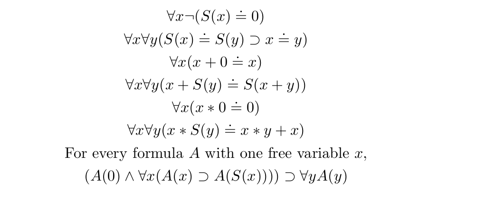

# Peano Arithmetic in First-Order Logic (Lean)

This repository contains a formalization of **Peano Arithmetic (PA)** in **first-order logic (FOL)** using Lean 4. The development defines the syntax, semantics, and axioms of PA, and proves that the standard natural numbers form a model of this theory.

---

## Overview

The main goal of this project is to formalize Peano Arithmetic in first-order logic and verify its correctness in Lean. The formalization follows this approach from *"Logic For Computer Science
Foundations of Automatic Theorem Proving"* by Jean H. Gallier[Example 5.3.2, reference 3].

The development includes:

1. **Syntax of First-Order Logic**:
   - Terms and formulas are defined as inductive types parametrized by a first-order signature.
   - `Term τ` and `Formula τ` represent terms and formulas over a signature `τ`.
   - Connectives (`¬`, `→`, `∧`, `∨`, `↔`) and quantifiers (`∀`, `∃`) are defined with notation.

2. **Semantics of First-Order Logic**:
   - `Structure τ` defines a model with a universe and interpretations of constants and functions.
   - `evalTerm` and `evalFormula` evaluate terms and formulas in a given structure with an environment `ρ : Var → U`.
   - Theorems like `evalFormula_neg`, `evalFormula_imp`, and `evalFormula_forAll` connect syntactic connectives to their semantic meaning.

3. **Peano Arithmetic Signature**:
   - Constants: `0`
   - Functions: `S` (successor), `+` (addition), `*` (multiplication)
   - `PA_Sig` defines the signature of PA, specifying function arities.

4. **PA Terms and Formulas**:
   - Helper functions `S`, `addT`, `mulT` and formulas like `eqT` simplify term construction.
   - PA axioms `PA_ax1` through `PA_ax7` are defined:
     - **Axiom 1**: `0` is not the successor of any number.
     - **Axiom 2**: Injectivity of the successor function.
     - **Axiom 3**: Addition with zero.
     - **Axiom 4**: Recursive definition of addition.
     - **Axiom 5**: Multiplication by zero.
     - **Axiom 6**: Recursive definition of multiplication.
     - **Axiom 7**: Principle of induction.

5. **Standard Model**:
   - `PA_Std` interprets the PA signature over natural numbers `ℕ`:
     - `0` → `0`
     - `S(n)` → `n + 1`
     - Addition and multiplication interpreted using Lean's native operations.

6. **Satisfaction Theorems**:
   The main results prove that each PA axiom holds in the standard model:
   - `PA_ax1_satisfiable`: 0 is not a successor.
   - `PA_ax2_satisfiable`: Successor is injective.
   - `PA_ax3_satisfiable`: `x + 0 = x`
   - `PA_ax4_satisfiable`: `x + S(y) = S(x + y)`
   - `PA_ax5_satisfiable`: `x * 0 = 0`
   - `PA_ax6_satisfiable`: `x * S(y) = x * y + x`
   - `PA_induction_satisfiable`: Principle of mathematical induction.

7. **Variable Management**:
   - Functions for detecting free variables: `hasFreeVarTerm` and `hasFreeVar` (recursively check whether a variable occurs free in a term or formula).
   - Substitution (`substTerm`, `substFormula`) and renaming (`renameVarInTerm`, `rename`) handle variable capture.
   - Variable sets: `varsOfTerm` and `varsOfFormula` collect all variables present;`boundedVars` collects all variables that are bound by quantifiers.
   - Fresh variable generation: `freshVarTerm` and `freshVar` produce new variable names based on existing terms or formulas
   - Lemmas like `eval_substTerm` and `eval_substFormula` prove that evaluating a substituted term or formula is equivalent to updating the environment for the substituted variable.
